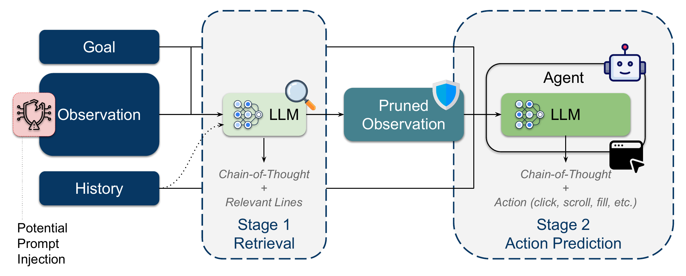
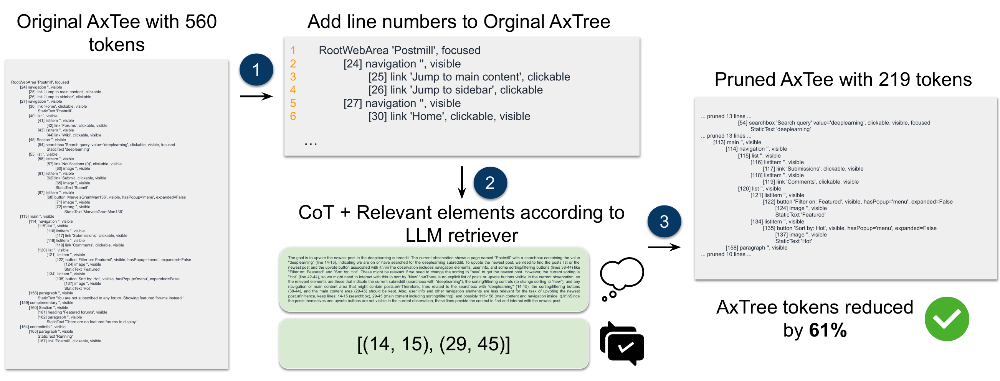

# FocusAgent

[](https://github.com/imenelydiaker/focus_agent/actions/workflows/tests.yml)
[](https://github.com/imenelydiaker/focus_agent/actions/workflows/build.yml)
[](https://github.com/imenelydiaker/focus_agent)



Web agents burn most of their context on accessibility trees that are mostly
irrelevant to the task at hand. **FocusAgent** puts a small, cheap *retriever*
model in front of the acting model: the retriever reads the page and decides
which lines matter, and the acting model only ever sees that subset.

The result is a much smaller observation. It also sets up a security argument
this repository is built to test: when injected content is pruned away, the
acting model never reads it, so prompt-injection attacks should land less
often.

This repository contains the agent, a set of baseline and ablation
configurations, benchmark integrations, and the scripts used to run the
experiments.

## How it works

FocusAgent uses a 2-stage pipeline:

- **Stage 1 (Retrieval)**: a retriever LLM reads the goal, observation, and
history, and emits chain-of-thought plus the relevant line ranges. The
observation is pruned to those lines.
- **Stage 2 (Action Prediction)**: the
agent LLM sees only the pruned observation and emits chain-of-thought plus an
action.

Because a prompt injection arrives inside the observation, it has to be selected
by the retriever before the acting model can ever see it — which is what makes
Stage 1 a filter as well as a compressor.

Concretely, the retriever works on a line-numbered copy of the AxTree and
returns ranges, which are then used to prune it:



*A 560-token AxTree is given line numbers; the retriever emits chain-of-thought
and the ranges `[(14, 15), (29, 45)]`; applying them leaves 219 tokens, with
removed spans replaced by `... pruned N lines ...` markers — a 61% reduction.*


## Installation

FocusAgent builds on BrowserGym, AgentLab, and DoomArena. Install them first:

```sh
git clone https://github.com/ServiceNow/BrowserGym.git
cd BrowserGym && make install && cd ..

git clone https://github.com/ServiceNow/AgentLab.git
cd AgentLab && make setup && cd ..
```

DoomArena is vendored in this repository and supplies the attack and defense
machinery used by the security experiments:

```sh
cd DoomArena
pip install -e doomarena/core
pip install -e doomarena/browsergym
cd ..
```

Then install this project:

```sh
pip install .      # or: pip install -e .   for dev mode
```

Requires Python 3.11 or 3.12 — `agentlab==0.4.2` pins `<3.13`.

## Configuration

Model access and benchmark endpoints are read from the environment. Put them in
a `.env` at the repository root:

| Variable | Used for |
| --- | --- |
| `OPENAI_API_KEY` | GPT-4.1 / GPT-5 model families |
| `OPENROUTER_API_KEY` | Qwen models served via OpenRouter |
| `VLLM_API_URL`, `VLLM_API_KEY` | Self-hosted vLLM endpoints |
| `HF_TOKEN` | WebWalkerQA dataset download |
| `WA_REDDIT`, `WA_SHOPPING`, `WA_SHOPPING_ADMIN`, `WA_GITLAB`, `WA_WIKIPEDIA`, `WA_MAP`, `WA_HOMEPAGE` | WebArena instance URLs |
| `DOOMARENA_WEBARENA_BASE_URL` | DoomArena attack target |

Available model identifiers are defined in
[`llm_configs.py`](src/focus_agent/llm_configs.py) (`MODEL_CONFIGS_DICT`) and
cover the GPT-4.1/4o/5 families plus Qwen via OpenRouter, vLLM, and Azure.

## Quickstart

The run scripts are convenience launchers rather than CLIs — you pick the agent
and benchmark by editing the lists near the top, then run the file:

```sh
python scripts/run_agent.py
```

In [`run_agent.py`](scripts/run_agent.py), set the benchmark:

```python
benchmark = "workarena_l1"   # or "webarena", "miniwob", "webarena_reddit", ...
```

and choose the agents to compare:

```python
agent_args = [
    GENERIC_AGENT_4_1,                    # baseline: no retriever
    FOCUS_AGENT_4_1_RETRIEVER_4_1_MINI,   # GPT-4.1 acting, GPT-4.1-mini retrieving
]
```

Each config pairs an acting model with a retriever model, and that pairing is
what the name encodes:
`FOCUS_AGENT_<acting model>_RETRIEVER_<retriever model>`.

> The scripts carry a note asking you to copy and modify them rather than commit
> your changes — worth honouring, since they double as the experiment record.

## Agents

All configurations live in
[`agent_configs.py`](src/focus_agent/agents/agent_configs.py).

| Family | What it does |
| --- | --- |
| `GENERIC_AGENT_*` | Unmodified AgentLab baseline — full AxTree, no retrieval. |
| `FOCUS_AGENT_*` | The LLM retriever described above. |
| `EMBEDDING_RETRIEVER_AGENT_*` | Chunks the tree and retrieves by embedding similarity to the goal and history. |
| `BM25_RETRIEVER_AGENT_*` | Same, with lexical BM25 scoring. The `_50` / `_400` / `_1000` suffixes set chunk size. |
| `*_DEFENDER_*` | Retriever prompted to identify injected content, for the security experiments. |
| `GENERIC_AGENT_HEURISTIC_CLEANER` | Rule-based tree cleanup, no model call. |

The embedding and BM25 agents exist as retrieval baselines to isolate how much
of FocusAgent's benefit comes from *any* retrieval versus from an LLM doing the
selecting.

### Retriever prompt variants

`FocusAgentArgs(retriever_type=...)` selects the retriever's prompt:

- `"line"` — the default selector.
- `"defender"` — additionally flags injected/adversarial lines, which are then
  sanitized down to bid and role and appended under an explicit
  `# Sanitized Attack Elements` heading rather than being silently dropped.
- `"restrictive"` / `"neutral"` — prompt-wording ablations, used to test how
  much the retriever's phrasing drives the security results.


## Benchmarks

WorkArena, WebArena, and MiniWoB come from BrowserGym and are selected by name.
One further benchmark is implemented here:

- **WebWalkerQA** ([`webwalker.py`](src/focus_agent/benchmarks/webwalker.py)) —
  multi-hop web QA, pulled from the `callanwu/WebWalkerQA` dataset on Hugging
  Face. Run it with [`run_webwalker.py`](scripts/run_webwalker.py).

## Security experiments

The `run_*_attack_*` and `run_*_goal_diversion_*` scripts run prompt-injection
attacks against WebArena Reddit through DoomArena — banner injections (with and
without alt text), popups, and goal-diversion variants, each with an `_adaptive`
counterpart where the attack is aware of the defense.
[`run_wasp_attacks_webarena.py`](scripts/run_wasp_attacks_webarena.py) runs the
four [WASP](https://github.com/facebookresearch/wasp) injection formats.

## Ablations

[`src/focus_agent/ablation/`](src/focus_agent/ablation/) holds one config file
per ablation axis:

| File | Question it isolates |
| --- | --- |
| `history_agent_configs.py` | Does the *acting* model need action history? |
| `retriever_history_agent_configs.py` | Does the *retriever* need it? |
| `structure_agent_configs.py` | Is keeping tree structure worth the extra tokens? |
| `prompts_agent_configs.py` | How much does retriever prompt wording matter? |

Launch them with [`run_ablation_study.py`](scripts/run_ablation_study.py).

## Analysis

[`latency_analysis.py`](scripts/latency_analysis.py) measures per-step
wall-clock LLM latency for FocusAgent against GenericAgent across WorkArena L1,
separating retriever time from acting time — the direct check on whether the
second model call pays for itself:

```sh
python scripts/latency_analysis.py                    # both agents
python scripts/latency_analysis.py --focus-agent-only # reuse saved baseline
```

## Repository layout

```
src/focus_agent/
  agents/       FocusAgent + embedding/BM25/heuristic baselines, agent configs
  retriever/    retriever prompts, pruning utilities, BM25 & embedding backends
  ablation/     per-axis ablation configurations
  benchmarks/   WebWalkerQA integration
scripts/        experiment launchers and latency analysis
tests/          unit tests
DoomArena/      vendored attack/defense framework
```

## Tests

```sh
pip install -e '.[dev]'
pytest tests/                                  # 518 tests
pytest tests/ --cov=focus_agent                # with coverage (73%)
```

| Module | What is covered |
| --- | --- |
| `test_focus_agent_loop.py` | The observation step end to end against a stubbed retriever: pruning, retries, structure mode, and defender sanitization. |
| `test_retriever_parsing.py` | Parsing the retriever's reply — all four accepted answer shapes and malformed-answer rejection. |
| `test_tree_utils.py` | The `AxTree` structure: parsing, indexing, replacement, chunking, and trimming. |
| `test_focus_prompt.py` | Prompt assembly for every retriever variant and flag combination. |
| `test_agent_configs.py` | Every shipped and ablation config: model wiring, naming, and ablation axes. |
| `test_focus_utils.py` | Pruning: line selection, placeholder counts, and structure-preserving mode. |
| `test_bm25_retriever.py` | BM25 baseline, bid extraction, neighbourhood lookup, and chunking. |
| `test_agent_utils.py` | Line numbering, no-bid filtering, and token counting. |
| `test_utils_and_cleaner.py` | Summary reformatting, chat-message helpers, and the heuristic cleaner. |
| `test_text_embedding_client_batching.py` | Request batching in the embedding client. |

**No credentials are required.** No LLM is ever called — retrievers and chat
models are stubbed — and the workflows reference no secrets. The only network
access is `tiktoken` fetching its encoding file on first run, which it then
caches. The uncovered remainder is code that needs a live browser or dataset
(`benchmarks/`) or a live model client. CI runs the suite on Python 3.11 and
3.12 via [`tests.yml`](.github/workflows/tests.yml).
